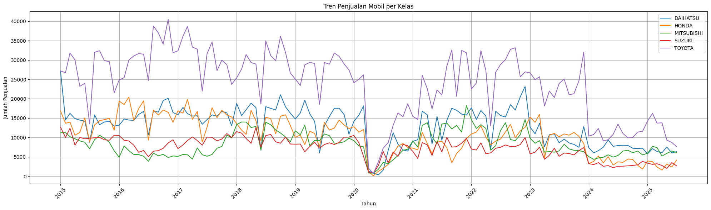

## Automotive Sales Forecasting using Weighted Ensemble Model

  
  
  
  
  

The digital era has brought us into the Industrial Revolution 4.0, where data has become one of the most valuable assets. The ability to process, analyze, and extract insights from data (data science) has become a crucial competency across various sectors, including the automotive industry. The automotive industry in Indonesia is one of the key pillars of the national economy and continues to grow dynamically.

### Table of Contents

- [Dataset](#dataset)
- [Libraries](#libraries)
- [Moving Average](#moving-average)
- [Sales Trend Analysis](#sales-trend-analysis)
- [Models](#models)
- [Results](#results)

### Dataset
The dataset used in this project is a CSV file named `dataCarSale2015-2025.csv`, which was obtained from the official website of the [Indonesian Automotive Industry Association (GAIKINDO)](https://www.gaikindo.or.id/indonesian-automobile-industry-data/). 

This dataset contains 126 rows, representing monthly automobile sales data over a specific time period.

The dataset consists of the following columns:

* waktu : Represents the time period in `YYYY-MM-DD` (Year–Month–Day) format.
* DAIHATSU : Monthly total sales of Daihatsu vehicles.
* HONDA : Monthly total sales of Honda vehicles.
* MITSUBISHI : Monthly total sales of Mitsubishi vehicles.
* SUZUKI : Monthly total sales of Suzuki vehicles.
* TOYOTA : Monthly total sales of Toyota vehicles.

### Libraries
This project uses several Python libraries to support data processing, modeling, and evaluation:

<pre>
import pandas as pd
import numpy as np
from statsmodels.tsa.arima.model import ARIMA
from prophet import Prophet
import lightgbm as lgb
from sklearn.metrics import mean_absolute_error
from sklearn.model_selection import train_test_split
import warnings
import matplotlib.pyplot as plt
</pre>

### Moving Average
To handle zero values in the sales data, a moving average approach was applied. Zero values were treated as missing data and replaced using a rolling mean with a window size of three periods. This method helps smooth short-term fluctuations and provides a more representative estimate based on neighboring data points, ensuring data continuity before further analysis and modeling.

 
*The following figure shows the sales trend in the dataset over time for each car brand, providing an overview of overall patterns and fluctuations.*

### Models
This project applies an ensemble learning approach with bias correction to improve sales forecasting performance, focusing on the TOYOTA sales column. Instead of relying on a single model, multiple forecasting models are combined to capture different patterns in the data and reduce prediction bias.

The ensemble consists of three models:
* ARIMA, which captures linear patterns and temporal dependencies in time series data
* Prophet, which models trend and seasonality effectively
* LightGBM, which learns complex and non-linear relationships from the data

### Results
The table below presents the final sales prediction results for each automotive brand based on the ensemble learning model:

| Brand | Final Prediction |
| :--- | :---: |
| DAIHATSU | 7,412 |
| HONDA | 4,429 |
| MITSUBISHI | 6,739 |
| SUZUKI | 3,492 |
| TOYOTA | 13,313 |

The forecasting performance was evaluated using Symmetric Mean Absolute Percentage Error (SMAPE), resulting in a value of 28.22%.